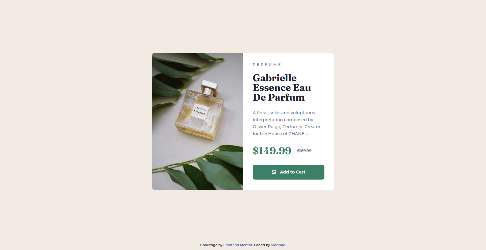
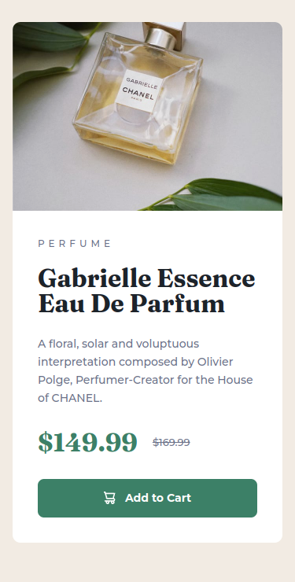

# Frontend Mentor - Product preview card component solution

This is a solution to the [Product preview card component challenge on Frontend Mentor](https://www.frontendmentor.io/challenges/product-preview-card-component-GO7UmttRfa). Frontend Mentor challenges help you improve your coding skills by building realistic projects.

## Table of contents

- [Overview](#overview)
  - [The challenge](#the-challenge)
  - [Screenshot](#screenshot)
  - [Links](#links)
- [My process](#my-process)
  - [Built with](#built-with)
  - [What I learned](#what-i-learned)
  - [Continued development](#continued-development)
  - [Useful resources](#useful-resources)
- [Author](#author)
- [Acknowledgments](#acknowledgments)

## Overview

### The challenge

Users should be able to:

- View the optimal layout depending on their device's screen size
- See hover and focus states for interactive elements

### Screenshot




### Links

- Solution URL: [Frontend Mentor | Product preview card component](https://www.frontendmentor.io/solutions/product-preview-card-component-z0BCForI0n)
- Live Site URL: [Product preview card component](https://sasanqc.github.io/product-preview-card-component/)

## My process

### Built with

- Flexbox
- Desktop-first workflow

### What I learned

I used picture tag to set different images for different screen sizes.

```html
<picture>
  <source srcset="images/image-product-mobile.jpg" media="(max-width: 375px)" />
  
</picture>
```

### Continued development

I have some problems with responsive design. so I will foucus on it on the next challenges.

### Useful resources

- [The Picture element](https://developer.mozilla.org/en-US/docs/Web/HTML/Element/picture) - This helped me to get useful information about picture tag in html.

## Author

- Github - [@sasanqc](https://github.com/sasanqc/)
- Frontend Mentor - [@sasanqc](https://www.frontendmentor.io/profile/sasanqc)
- Twitter - [@sasanqc](https://www.twitter.com/sasanqc)
